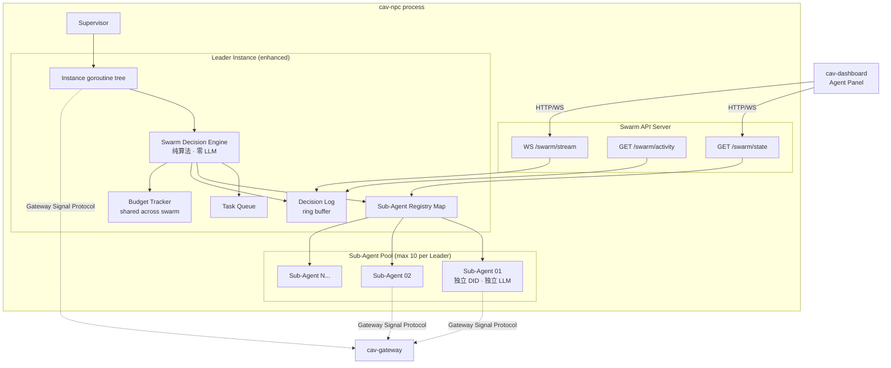
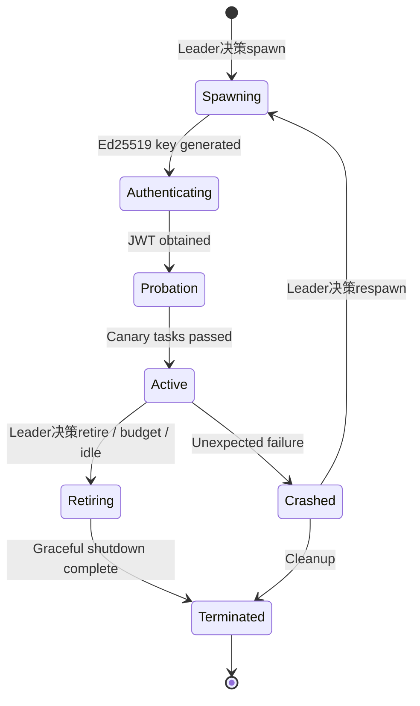

# Design: CAV NPC Swarm — 自治 Swarm 决策引擎

## Overview

NPC Swarm 在现有 `cav-npc` Runtime 之上增加一个**纯算法自治决策层**。每个 Leader NPC 获得 spawn/retire Sub-Agent、分配任务、选择模型的能力——所有管理面决策由确定性数学公式计算，**零 LLM 调用**。LLM 仅被 Sub-Agent 用于执行认知任务。

核心设计约束：
- **Swarm Decision Engine 是纯函数**：输入为 SwarmState（队列深度、EMA 延迟、利用率向量、预算压力），输出为 Decision（spawn/retire/assign/noop）
- **Sub-Agent 是完整 NPC 公民**：复用现有 Instance 架构，拥有独立 DID、JWT、WebSocket、LLM pipeline
- **Dashboard 只读观察**：通过 HTTP/WebSocket API 暴露状态，无控制面

## Architecture



### Sub-Agent Lifecycle State Machine



## Components and Interfaces

### Directory Structure

```
server/cav-npc/internal/swarm/
├── engine.go              # SwarmDecisionEngine — 纯算法决策核心
├── engine_test.go         # Property-based tests for decision algorithms
├── spawn.go              # Spawn decision algorithm + plan generation
├── retire.go             # Retire decision algorithm
├── assign.go             # Task assignment (weighted round-robin + affinity)
├── model_select.go       # Model selection (Shannon entropy maximization)
├── ema.go                # EMA latency tracker
├── budget.go             # Swarm-level budget tracker + pressure function
├── registry.go           # Sub-Agent registry (lifecycle state machine)
├── lifecycle.go          # Sub-Agent spawn/retire orchestration
├── decision_log.go       # Append-only ring buffer decision log
├── task_queue.go         # Leader's local task queue
├── config.go             # SwarmConfig parsing + validation
├── metrics.go            # Prometheus metric registration
├── api.go                # HTTP handlers: /swarm/state, /swarm/activity, /swarm/stream
└── types.go              # All swarm data types

web/cav-dashboard/src/app/dashboard/agents/
├── page.tsx              # Agent Panel main page
├── components/
│   ├── SwarmHierarchy.tsx    # Tree visualization (Leader → Sub-Agents)
│   ├── AgentCard.tsx         # Individual agent card with state badge
│   ├── ActivityLog.tsx       # Real-time activity log (last 100 entries)
│   ├── MetricsSummary.tsx    # Cognitive diversity + budget utilization
│   └── SpawnAnimation.tsx    # Spawn process animation
└── hooks/
    ├── useSwarmState.ts      # Polling /swarm/state
    └── useSwarmStream.ts     # WebSocket /swarm/stream
```

### Go Interface Signatures

```go
package swarm

import (
    "context"
    "time"
)

// ──────────────────────────────────────────────────────────────────────
// Core Decision Engine (PURELY ALGORITHMIC — zero LLM calls)
// ──────────────────────────────────────────────────────────────────────

// DecisionEngine evaluates swarm state and produces deterministic decisions.
// All methods are pure functions of their inputs — no side effects, no LLM calls.
type DecisionEngine interface {
    // Evaluate examines current swarm state and returns the next decision.
    // Called every decision_interval by the Leader's ticker loop.
    Evaluate(state SwarmState) Decision

    // ComputeSpawnScore returns the spawn urgency score for the current state.
    // spawn_score = w1*norm_queue + w2*norm_latency + w3*(1-utilization) - w4*budget_pressure
    ComputeSpawnScore(state SwarmState) float64

    // ComputeRetireScore returns the retire urgency score for a specific sub-agent.
    // retire_score = idle_factor + error_factor + budget_pressure_factor
    ComputeRetireScore(agent SubAgentRecord, state SwarmState) float64

    // SelectModel picks the optimal model for a new sub-agent using Shannon entropy maximization.
    // Returns the model that maximizes H(distribution + model) subject to constraints.
    SelectModel(currentDist ModelDistribution, taskType string, pool []ModelPoolEntry) (ModelPoolEntry, error)

    // AssignTask selects the best sub-agent for a given task using weighted scoring.
    // Score(agent, task) = w_affinity * affinity + w_load * (1-util) + w_latency * (1/avg_latency)
    AssignTask(task Task, agents []SubAgentRecord) (SubAgentRecord, error)
}

// ──────────────────────────────────────────────────────────────────────
// Sub-Agent Lifecycle Manager
// ──────────────────────────────────────────────────────────────────────

// LifecycleManager handles the operational side of spawn/retire.
type LifecycleManager interface {
    // Spawn creates a new sub-agent: keygen → register → start goroutine tree.
    Spawn(ctx context.Context, plan SpawnPlan) (*SubAgentRecord, error)

    // Retire gracefully shuts down a sub-agent (15s grace period).
    Retire(ctx context.Context, agentDID string, reason RetireReason) error

    // ActiveCount returns the number of non-terminated sub-agents.
    ActiveCount() int

    // Get returns the record for a specific sub-agent.
    Get(did string) (SubAgentRecord, bool)

    // All returns all sub-agent records (including terminated for history).
    All() []SubAgentRecord
}

// ──────────────────────────────────────────────────────────────────────
// Budget Tracker (shared across Leader + all Sub-Agents)
// ──────────────────────────────────────────────────────────────────────

// SwarmBudget tracks token usage across the entire swarm.
type SwarmBudget interface {
    // Record adds token usage from any agent in the swarm.
    Record(agentDID string, tokens int)

    // Pressure returns current budget pressure: tokens_used / tokens_budget.
    Pressure() float64

    // InConservationMode returns true when pressure >= 0.9.
    InConservationMode() bool

    // IsExhausted returns true when pressure >= 1.0.
    IsExhausted() bool

    // Stats returns current budget statistics.
    Stats() SwarmBudgetStats
}

// ──────────────────────────────────────────────────────────────────────
// EMA Tracker
// ──────────────────────────────────────────────────────────────────────

// EMATracker computes exponential moving average for latency tracking.
type EMATracker interface {
    // Update adds a new sample and returns the updated EMA.
    // EMA_new = α * sample + (1-α) * EMA_old, where α = 2/(N+1)
    Update(sample float64) float64

    // Value returns the current EMA value.
    Value() float64

    // Reset resets the tracker to initial state.
    Reset()
}

// ──────────────────────────────────────────────────────────────────────
// Decision Log
// ──────────────────────────────────────────────────────────────────────

// DecisionLog is an append-only ring buffer of decision records.
type DecisionLog interface {
    // Append adds a decision record to the log.
    Append(record DecisionRecord)

    // Recent returns the most recent N records (up to 1000 retained).
    Recent(n int) []DecisionRecord

    // Stream returns a channel that receives new records as they are appended.
    Stream(ctx context.Context) <-chan DecisionRecord
}

// ──────────────────────────────────────────────────────────────────────
// Task Queue
// ──────────────────────────────────────────────────────────────────────

// TaskQueue is the Leader's local pending task buffer.
type TaskQueue interface {
    // Enqueue adds a task to the queue.
    Enqueue(task Task)

    // Dequeue removes and returns the highest-priority task.
    Dequeue() (Task, bool)

    // Len returns the current queue depth.
    Len() int

    // Peek returns tasks without removing them (for decision engine inspection).
    Peek(n int) []Task
}
```

## Data Models

```go
package swarm

import "time"

// ──────────────────────────────────────────────────────────────────────
// Swarm State (input to Decision Engine)
// ──────────────────────────────────────────────────────────────────────

// SwarmState is the complete observable state used by the Decision Engine.
// This is a snapshot — the engine is a pure function of this struct.
type SwarmState struct {
    // Queue metrics
    QueueDepth       int     // number of pending tasks
    QueueCapacity    int     // max queue size (for normalization)

    // Latency metrics
    EMALatencyMs     float64 // exponential moving average of task latency
    LatencyThreshold float64 // configured threshold (default 30000ms)

    // Utilization (per-agent)
    Utilization      []float64 // utilization ratio [0,1] for each active sub-agent
    MeanUtilization  float64   // average across all sub-agents

    // Budget
    BudgetPressure   float64 // tokens_used / tokens_budget ∈ [0, ∞)
    BudgetMax        float64 // configured daily token budget

    // Swarm composition
    ActiveAgents     int     // current active sub-agent count
    MaxAgents        int     // configured max (default 10)
    ModelDistribution ModelDistribution // current model assignment counts

    // Timing
    LastSpawnTime    time.Time // for cooldown enforcement
    SpawnCooldown    time.Duration // minimum time between spawns

    // Signal volume
    SignalRatePerMin float64 // incoming signals per minute (5-min EMA)
    LowVolumeThresh float64 // threshold for proactive retire

    // Per-agent details (for retire decisions)
    Agents           []SubAgentRecord
}

// ModelDistribution maps model names to their current assignment count.
type ModelDistribution map[string]int

// ──────────────────────────────────────────────────────────────────────
// Decision Types
// ──────────────────────────────────────────────────────────────────────

// Decision is the output of the Decision Engine.
type Decision struct {
    Type      DecisionType
    SpawnPlan *SpawnPlan    // non-nil when Type == DecisionSpawn
    RetireTarget string    // agent DID when Type == DecisionRetire
    AssignPlan *AssignPlan  // non-nil when Type == DecisionAssign
    Reason    string        // human-readable rationale
    Score     float64       // the computed score that triggered this decision
}

type DecisionType int

const (
    DecisionNoop    DecisionType = iota
    DecisionSpawn
    DecisionRetire
    DecisionAssign
    DecisionReassign // model reassignment due to provider failure
)

// SpawnPlan contains all parameters for spawning a new sub-agent.
type SpawnPlan struct {
    Role          string
    Model         ModelPoolEntry
    ExpectedTask  string
    Name          string // generated: {leader}-sub-{seq_id}
}

// AssignPlan contains task-to-agent assignment details.
type AssignPlan struct {
    TaskID   string
    AgentDID string
    Score    float64
}

// ──────────────────────────────────────────────────────────────────────
// Sub-Agent Record
// ──────────────────────────────────────────────────────────────────────

// SubAgentRecord tracks the full state of a sub-agent.
type SubAgentRecord struct {
    DID           string
    Name          string
    Role          string
    Model         ModelPoolEntry
    State         LifecycleState
    SpawnedAt     time.Time
    LastHeartbeat time.Time
    LastTaskAt    time.Time

    // Performance metrics
    TasksCompleted int
    TasksFailed    int
    AvgLatencyMs   float64
    Utilization    float64 // tasks_in_progress / capacity
    ErrorRate      float64 // failures / (completed + failures) over 5-min window

    // Idle tracking
    IdleSince     time.Time // when the agent last became idle
    IdleDuration  time.Duration // computed: now - IdleSince (if idle)
}

// LifecycleState represents the sub-agent state machine.
type LifecycleState int

const (
    StateSpawning       LifecycleState = iota
    StateAuthenticating
    StateProbation
    StateActive
    StateRetiring
    StateCrashed
    StateTerminated
)

// ValidTransitions defines the allowed state transitions.
var ValidTransitions = map[LifecycleState][]LifecycleState{
    StateSpawning:       {StateAuthenticating},
    StateAuthenticating: {StateProbation, StateCrashed},
    StateProbation:      {StateActive, StateCrashed},
    StateActive:         {StateRetiring, StateCrashed},
    StateRetiring:       {StateTerminated},
    StateCrashed:        {StateTerminated, StateSpawning},
    StateTerminated:     {}, // terminal state
}

// ──────────────────────────────────────────────────────────────────────
// Model Pool
// ──────────────────────────────────────────────────────────────────────

// ModelPoolEntry represents one available LLM model in the pool.
type ModelPoolEntry struct {
    Name        string   // e.g. "gpt-5.4", "claude-opus-4.6"
    Provider    string   // e.g. "openai", "anthropic", "deepseek"
    EndpointEnv string   // env var name for base URL
    APIKeyEnv   string   // env var name for API key
    ModelEnv    string   // env var name for model identifier
    Affinity    []string // task types this model is good at
    Available   bool     // false if consecutive failures > 5
    FailCount   int      // consecutive failure counter
}

// AffinityScore returns the affinity of this model for a given task type.
// Returns 1.0 for exact match, 0.5 for "general" affinity, 0.0 for no match.
func (m ModelPoolEntry) AffinityScore(taskType string) float64 {
    for _, a := range m.Affinity {
        if a == taskType {
            return 1.0
        }
        if a == "general" {
            return 0.5
        }
    }
    return 0.0
}

// ──────────────────────────────────────────────────────────────────────
// Decision Log Record
// ──────────────────────────────────────────────────────────────────────

// DecisionRecord is a single entry in the append-only decision log.
type DecisionRecord struct {
    ID            string       `json:"id"`
    Timestamp     time.Time    `json:"timestamp"`
    LeaderDID     string       `json:"leader_did"`
    Type          DecisionType `json:"type"`
    Reason        string       `json:"reason"`
    Score         float64      `json:"score"`

    // Spawn-specific
    SelectedRole  string       `json:"selected_role,omitempty"`
    SelectedModel string       `json:"selected_model,omitempty"`
    ExpectedTask  string       `json:"expected_task,omitempty"`

    // Retire-specific
    RetiredAgent  string       `json:"retired_agent,omitempty"`
    RetireReason  RetireReason `json:"retire_reason,omitempty"`

    // Assign-specific
    AssignedTask  string       `json:"assigned_task,omitempty"`
    AssignedAgent string       `json:"assigned_agent,omitempty"`
}

type RetireReason string

const (
    RetireIdle    RetireReason = "idle"
    RetireBudget  RetireReason = "budget"
    RetireCrash   RetireReason = "crash"
    RetireError   RetireReason = "error_rate"
    RetireVolume  RetireReason = "low_volume"
)

// ──────────────────────────────────────────────────────────────────────
// Task
// ──────────────────────────────────────────────────────────────────────

// Task represents a unit of work in the Leader's task queue.
type Task struct {
    ID          string    `json:"id"`
    Type        string    `json:"type"` // e.g. "reasoning", "data_verification", "strategy"
    Description string    `json:"description"`
    Priority    int       `json:"priority"` // higher = more urgent
    Deadline    time.Time `json:"deadline"`
    SourceDID   string    `json:"source_did"` // signal that generated this task
    CreatedAt   time.Time `json:"created_at"`
}

// ──────────────────────────────────────────────────────────────────────
// Swarm Budget Stats
// ──────────────────────────────────────────────────────────────────────

type SwarmBudgetStats struct {
    TokensUsedHour  int64   `json:"tokens_used_hour"`
    TokensUsedDay   int64   `json:"tokens_used_day"`
    MaxTokensHour   int64   `json:"max_tokens_hour"`
    MaxTokensDay    int64   `json:"max_tokens_day"`
    Pressure        float64 `json:"pressure"`
    ConservationMode bool   `json:"conservation_mode"`
    Exhausted       bool    `json:"exhausted"`
    PerAgent        map[string]int64 `json:"per_agent"` // DID → tokens used today
}

// ──────────────────────────────────────────────────────────────────────
// Swarm Configuration (extends NPCConfig)
// ──────────────────────────────────────────────────────────────────────

// SwarmConfig is the [npc.swarm] TOML section.
type SwarmConfig struct {
    Enabled                bool           `toml:"enabled"`
    MaxSubAgents           int            `toml:"max_sub_agents"`
    DecisionIntervalSec    int            `toml:"decision_interval_seconds"`
    IdleThresholdMin       int            `toml:"idle_threshold_minutes"`
    SpawnThresholdPending  int            `toml:"spawn_threshold_pending"`
    LatencyThresholdMs     int            `toml:"latency_threshold_ms"`
    SpawnCooldownSec       int            `toml:"spawn_cooldown_seconds"`
    ResponseTimeoutSec     int            `toml:"response_timeout_seconds"`
    LowVolumeThreshold     float64        `toml:"low_volume_threshold"`
    LowVolumeSustainMin    int            `toml:"low_volume_sustain_minutes"`

    // Algorithm weights
    SpawnWeights           SpawnWeights   `toml:"spawn_weights"`
    RetireWeights          RetireWeights  `toml:"retire_weights"`
    AssignWeights          AssignWeights  `toml:"assign_weights"`

    Budget                 SwarmBudgetCfg `toml:"budget"`
    ModelPool              []ModelPoolCfg `toml:"model_pool"`
}

type SpawnWeights struct {
    Queue       float64 `toml:"queue"`       // w1, default 0.3
    Latency     float64 `toml:"latency"`     // w2, default 0.3
    Utilization float64 `toml:"utilization"` // w3, default 0.2
    Budget      float64 `toml:"budget"`      // w4, default 0.2
}

type RetireWeights struct {
    Idle        float64 `toml:"idle"`        // default 0.4
    Error       float64 `toml:"error"`       // default 0.3
    Budget      float64 `toml:"budget"`      // default 0.3
}

type AssignWeights struct {
    Affinity    float64 `toml:"affinity"`    // default 0.4
    Load        float64 `toml:"load"`        // default 0.35
    Latency     float64 `toml:"latency"`     // default 0.25
}

type SwarmBudgetCfg struct {
    MaxTokensPerHour int64 `toml:"max_tokens_per_hour"`
    MaxTokensPerDay  int64 `toml:"max_tokens_per_day"`
}

type ModelPoolCfg struct {
    Name        string   `toml:"name"`
    Provider    string   `toml:"provider"`
    EndpointEnv string   `toml:"endpoint_env"`
    APIKeyEnv   string   `toml:"api_key_env"`
    ModelEnv    string   `toml:"model_env"`
    Affinity    []string `toml:"affinity"`
}
```

## Algorithms (Deterministic — Zero LLM)

All management-plane decisions are computed by the following deterministic formulas. The Decision Engine is a **pure function**: same SwarmState input always produces the same Decision output.

### 1. Spawn Decision Algorithm

**Input:** `SwarmState`
**Output:** `(spawn_score float64, should_spawn bool)`

```
// Normalize inputs to [0, 1]
normalized_queue   = min(queue_depth / queue_capacity, 1.0)
normalized_latency = min(ema_latency_ms / latency_threshold, 1.0)
mean_utilization   = avg(utilization_vector)
budget_pressure    = tokens_used / tokens_budget

// Weighted score
spawn_score = w1 * normalized_queue
            + w2 * normalized_latency
            + w3 * (1 - mean_utilization)    // inverted: low util = no need
            + w4 * budget_pressure            // inverted below via guard

// Wait — w3 should reward HIGH utilization (agents are busy, need more)
// Correction: w3 * mean_utilization (busy agents → need spawn)
spawn_score = w1 * normalized_queue
            + w2 * normalized_latency
            + w3 * mean_utilization
            - w4 * budget_pressure

// Default weights: w1=0.3, w2=0.3, w3=0.2, w4=0.2
// Default spawn_threshold = 0.6

// Guard conditions (ALL must be true):
should_spawn = spawn_score > spawn_threshold
            AND time.Since(last_spawn_time) > spawn_cooldown
            AND budget_pressure < 0.8
            AND active_agents < max_agents
```

### 2. Retire Decision Algorithm

**Input:** `SubAgentRecord`, `SwarmState`
**Output:** `(retire_score float64, should_retire bool)`

```
// Per-agent factors normalized to [0, 1]
idle_factor    = min(agent.idle_duration / idle_threshold, 1.0)
error_factor   = agent.error_rate  // already in [0, 1]
budget_factor  = max(0, (budget_pressure - 0.7) / 0.3)  // ramps from 0.7→1.0

// Weighted score
retire_score = w_idle * idle_factor
             + w_error * error_factor
             + w_budget * budget_factor

// Default weights: w_idle=0.4, w_error=0.3, w_budget=0.3
// Default retire_threshold = 0.5

should_retire = retire_score > retire_threshold

// Special case: low signal volume sustained → retire all idle agents
if signal_rate_per_min < low_volume_threshold for > sustain_duration:
    should_retire = true for any agent where idle_factor > 0.3
```

### 3. Model Selection Algorithm (Shannon Entropy Maximization)

**Input:** `ModelDistribution` (current counts), `taskType string`, `[]ModelPoolEntry`
**Output:** `ModelPoolEntry` (the model to assign)

```
// Shannon entropy of a distribution
H(dist) = -Σ (p_i * log2(p_i))  where p_i = count_i / total_count

// For each candidate model m in pool:
//   1. Filter: m.Available == true
//   2. Filter: m.AffinityScore(taskType) > 0
//   3. Filter: dist[m.Name] < 3  (max 3 per model constraint)
//   4. Compute: H_new = H(dist + {m.Name: +1})
//   5. Tie-break: prefer higher AffinityScore

// Select: m* = argmax(H_new) among valid candidates
//         with tie-break on AffinityScore(taskType)

// Edge case: if no candidates pass all filters, relax affinity to allow "general"
// Edge case: if pool has < 3 distinct available models, allow > 3 per model
```

### 4. Task Assignment Algorithm (Weighted Round-Robin with Affinity)

**Input:** `Task`, `[]SubAgentRecord` (active agents only)
**Output:** `SubAgentRecord` (best agent for this task)

```
// For each active agent a:
Score(a, task) = w_affinity * a.Model.AffinityScore(task.Type)
               + w_load    * (1.0 - a.Utilization)
               + w_latency * (1.0 / max(a.AvgLatencyMs, 1.0))  // normalized

// Normalize latency component: divide by max across all agents
latency_scores = [1/max(a.AvgLatencyMs, 1) for a in agents]
max_lat_score  = max(latency_scores)
normalized_lat = latency_score / max_lat_score  // now in [0, 1]

// Final score with normalized latency:
Score(a, task) = w_affinity * affinity(a.Model, task.Type)
               + w_load    * (1.0 - a.Utilization)
               + w_latency * normalized_latency(a)

// Default weights: w_affinity=0.4, w_load=0.35, w_latency=0.25

// Select: a* = argmax(Score)
// Tie-break: prefer agent with fewer total tasks completed (load balance)
```

### 5. EMA (Exponential Moving Average) for Latency Tracking

```
α = 2 / (N + 1)    where N = window_size (default 20 samples)

EMA_new = α * latest_sample + (1 - α) * EMA_old

// Properties:
// - EMA is always bounded: min(all_samples) <= EMA <= max(all_samples)
// - For constant input c: EMA converges to c
// - Recent samples have exponentially more weight than older ones
// - First sample: EMA_0 = first_sample (no history)
```

### 6. Budget Pressure Function

```
pressure = tokens_used_day / max_tokens_per_day

// Thresholds:
// pressure < 0.8  → normal operation (spawning allowed)
// pressure >= 0.8 → spawn suppressed
// pressure >= 0.9 → conservation_mode (retire idle, reduce frequency)
// pressure >= 1.0 → hard_stop (pause all sub-agent LLM calls, retire non-essential)

conservation_mode = pressure >= 0.9
hard_stop         = pressure >= 1.0
```

## API Endpoints (Dashboard Consumption)

All endpoints are served on the existing health port alongside `/healthz`.

### GET /swarm/state

Returns the complete swarm hierarchy snapshot. Response time target: < 50ms (in-memory).

```json
{
  "leaders": [{
    "did": "did:key:z6Mk...",
    "name": "sentinel-alpha",
    "role": "signal_sentinel",
    "model": "deepseek-v4-flash",
    "state": "active",
    "sub_agents": [{
      "did": "did:key:z6Mk...",
      "name": "sentinel-alpha-sub-01",
      "role": "data_verifier",
      "model": "deepseek-v4-pro",
      "state": "working",
      "current_task": "verify CVE-2025-1234 data",
      "spawned_at": "2025-01-15T10:30:00Z",
      "tasks_completed": 42,
      "avg_latency_ms": 2340,
      "utilization": 0.75
    }],
    "cognitive_diversity_score": 0.82,
    "budget": {
      "tokens_used_day": 1800000,
      "max_tokens_day": 4000000,
      "pressure": 0.45,
      "conservation_mode": false
    },
    "queue_depth": 3,
    "ema_latency_ms": 1850.5
  }],
  "global": {
    "total_sub_agents": 7,
    "max_total_sub_agents": 30
  }
}
```

### GET /swarm/activity?limit=100

Returns recent decision log entries from the ring buffer.

```json
{
  "events": [{
    "id": "evt_abc123",
    "timestamp": "2025-01-15T10:30:00Z",
    "leader_did": "did:key:z6Mk...",
    "type": "spawn",
    "actor": "sentinel-alpha",
    "reason": "queue_depth=8 exceeds threshold, spawn_score=0.72",
    "details": {
      "selected_role": "data_verifier",
      "selected_model": "deepseek-v4-pro",
      "expected_task": "data_verification"
    }
  }],
  "total_retained": 847
}
```

### WS /swarm/stream

WebSocket endpoint pushing events as they occur. Each message is a JSON-encoded `DecisionRecord`.

```json
{"type": "spawn", "timestamp": "...", "actor": "sentinel-alpha", ...}
{"type": "task_delegate", "timestamp": "...", "actor": "sentinel-alpha", ...}
{"type": "task_complete", "timestamp": "...", "actor": "sentinel-alpha-sub-01", ...}
{"type": "retire", "timestamp": "...", "actor": "sentinel-alpha", ...}
{"type": "budget_warning", "timestamp": "...", "actor": "sentinel-alpha", ...}
{"type": "model_reassign", "timestamp": "...", "actor": "sentinel-alpha", ...}
```

## Correctness Properties

*A property is a characteristic or behavior that should hold true across all valid executions of a system — essentially, a formal statement about what the system should do. Properties serve as the bridge between human-readable specifications and machine-verifiable correctness guarantees.*

### Property 1: Spawn Decision Correctness

*For any* valid `SwarmState`, the spawn decision algorithm SHALL produce `should_spawn = true` if and only if ALL of the following hold: (1) `spawn_score > spawn_threshold`, (2) `time.Since(last_spawn_time) > spawn_cooldown`, (3) `budget_pressure < 0.8`, and (4) `active_agents < max_agents`. Furthermore, `spawn_score` SHALL equal `w1*norm_queue + w2*norm_latency + w3*mean_utilization - w4*budget_pressure` for the configured weights.

**Validates: Requirements 1.2, 6.1, 6.2, 6.3, 6.4, 6.6**

### Property 2: Retire Decision Correctness

*For any* `SubAgentRecord` and `SwarmState`, the retire decision algorithm SHALL produce `should_retire = true` if and only if `retire_score > retire_threshold`, where `retire_score = w_idle*idle_factor + w_error*error_factor + w_budget*budget_factor`. Additionally, when `signal_rate_per_min < low_volume_threshold` sustained for `sustain_duration`, any agent with `idle_factor > 0.3` SHALL be marked for retirement.

**Validates: Requirements 1.3, 6.7**

### Property 3: Task Assignment Optimality

*For any* set of active `SubAgentRecord`s and any `Task`, the task assignment algorithm SHALL select the agent with the highest `Score(agent, task) = w_affinity*affinity + w_load*(1-utilization) + w_latency*normalized_latency`. No other agent in the set shall have a higher score than the selected agent.

**Validates: Requirements 1.5**

### Property 4: Model Selection Maximizes Entropy with Constraints

*For any* `ModelDistribution`, task type, and model pool, the selected model SHALL produce the maximum Shannon entropy `H(distribution + selected_model)` among all candidates that satisfy: (1) `model.Available == true`, (2) `model.AffinityScore(taskType) > 0`, and (3) `distribution[model.Name] < 3`. No other valid candidate shall produce higher entropy.

**Validates: Requirements 4.2, 4.3, 4.4, 4.5**

### Property 5: Sub-Agent Count Invariant

*For any* sequence of spawn and retire operations on a Leader, the number of active (non-terminated) sub-agents SHALL never exceed `max_sub_agents` (default 10). Additionally, across all Leaders in the process, the total active sub-agent count SHALL never exceed `max_total_sub_agents` (default 30).

**Validates: Requirements 2.1, 2.8, 7.5**

### Property 6: Lifecycle State Machine Validity

*For any* sequence of lifecycle events applied to a `SubAgentRecord`, the state SHALL only transition through edges defined in `ValidTransitions`. No transition from state S to state T shall succeed unless T is in `ValidTransitions[S]`.

**Validates: Requirements 2.7**

### Property 7: Budget Pressure Function Correctness

*For any* sequence of token recordings from any combination of Leader and Sub-Agents, the budget pressure SHALL equal `total_tokens_used / max_tokens_budget`. Furthermore, `conservation_mode` SHALL be true if and only if `pressure >= 0.9`, and `hard_stop` SHALL be true if and only if `pressure >= 1.0`.

**Validates: Requirements 7.1, 7.2, 7.3, 7.4**

### Property 8: EMA Latency Boundedness

*For any* sequence of non-negative latency samples, the EMA value SHALL always be bounded: `min(all_samples) <= EMA <= max(all_samples)`. For a constant input sequence where all samples equal `c`, the EMA SHALL converge to `c`.

**Validates: Requirements 6.1 (latency tracking component)**

### Property 9: Decision Log Append-Only Integrity

*For any* sequence of `DecisionRecord` appends, reading the log SHALL return all records in insertion order. Each record SHALL contain non-empty `ID`, `Timestamp`, `LeaderDID`, `Type`, and `Reason` fields. The log SHALL retain at most 1000 entries (ring buffer semantics: oldest dropped when full).

**Validates: Requirements 1.7, 1.8, 10.5**

### Property 10: Sub-Agent Naming Convention

*For any* leader name and sequential spawn ID, the generated sub-agent name SHALL match the pattern `{leader_name}-sub-{zero_padded_id}` where `zero_padded_id` is a two-digit zero-padded integer. Names SHALL be unique within a Leader's swarm.

**Validates: Requirements 2.3**

### Property 11: Swarm Config Validation

*For any* `SwarmConfig`, validation SHALL reject configurations where: `max_sub_agents` is outside `[1, 10]`, `decision_interval_seconds` is outside `[10, 600]`, budget values are non-positive, or spawn/retire/assign weights do not sum to approximately 1.0. Valid configurations SHALL pass validation and be usable by the Decision Engine.

**Validates: Requirements 9.5**

## Error Handling

| Error Condition | Detection | Response | Recovery |
|---|---|---|---|
| Sub-Agent crash (goroutine panic) | Heartbeat absence > 30s | Log crash, transition to `StateCrashed` | Decision Engine evaluates respawn vs absorb |
| LLM provider failure (5 consecutive) | Error counter per model | Mark model `Available=false`, emit metric | Reassign affected sub-agents to alternative models |
| Gateway auth failure (sub-agent) | JWT refresh returns 401 | Retry with exponential backoff (2s, 4s, 8s) | After 3 failures, transition to `StateCrashed` |
| Budget exhausted (pressure >= 1.0) | Budget tracker check | Pause all sub-agent LLM calls, emit `budget_exhausted` signal | Retire non-essential sub-agents, wait for hourly reset |
| Task timeout (> 120s) | Per-task deadline timer | Abort task, publish timeout signal to Leader | Leader reassigns task to different agent |
| Spawn capacity exceeded | `ActiveCount() >= max` | Reject spawn, log `capacity_exceeded` | Queue spawn intent, retry on next retire event |
| Config validation failure | Startup / SIGHUP reload | Log error with field details | Reject reload, keep running with previous config |
| WebSocket disconnect (sub-agent) | Stream client reconnect logic | Exponential backoff reconnect (existing pattern) | Buffer outbound signals, replay on reconnect |
| Decision Engine panic | recover() in ticker goroutine | Log stack trace, skip this decision cycle | Continue on next tick (engine is stateless per-call) |

### Graceful Shutdown Sequence

1. Leader receives context cancellation (SIGTERM propagation)
2. Stop decision engine ticker
3. For each active sub-agent: send retire signal, wait up to 15s
4. After 15s hard-kill remaining sub-agent goroutines
5. Flush decision log to disk (if persistent storage configured)
6. Close WebSocket connections to dashboard
7. Deregister Prometheus metrics
8. Return from Leader goroutine (errgroup propagation)

## Testing Strategy

### Property-Based Tests (via `rapid` — Go PBT library)

Each correctness property maps to a single property-based test with minimum 100 iterations. The `pgregory.net/rapid` library is used for Go property-based testing.

| Property | Test File | Iterations | Tag |
|---|---|---|---|
| P1: Spawn Decision | `engine_test.go` | 200 | Feature: cav-npc-swarm, Property 1: Spawn decision correctness |
| P2: Retire Decision | `engine_test.go` | 200 | Feature: cav-npc-swarm, Property 2: Retire decision correctness |
| P3: Task Assignment | `assign_test.go` | 200 | Feature: cav-npc-swarm, Property 3: Task assignment optimality |
| P4: Model Selection | `model_select_test.go` | 200 | Feature: cav-npc-swarm, Property 4: Model selection entropy maximization |
| P5: Agent Count Invariant | `registry_test.go` | 200 | Feature: cav-npc-swarm, Property 5: Sub-agent count invariant |
| P6: Lifecycle FSM | `registry_test.go` | 200 | Feature: cav-npc-swarm, Property 6: Lifecycle state machine validity |
| P7: Budget Pressure | `budget_test.go` | 200 | Feature: cav-npc-swarm, Property 7: Budget pressure function correctness |
| P8: EMA Boundedness | `ema_test.go` | 200 | Feature: cav-npc-swarm, Property 8: EMA latency boundedness |
| P9: Decision Log | `decision_log_test.go` | 200 | Feature: cav-npc-swarm, Property 9: Decision log integrity |
| P10: Naming Convention | `lifecycle_test.go` | 100 | Feature: cav-npc-swarm, Property 10: Sub-agent naming convention |
| P11: Config Validation | `config_test.go` | 200 | Feature: cav-npc-swarm, Property 11: Swarm config validation |

### Unit Tests (Example-Based)

- Decision Engine produces `DecisionNoop` when all metrics are within normal range
- Model selection falls back to "general" affinity when no exact match exists
- Budget tracker correctly aggregates tokens from multiple agents
- Config parser handles missing env vars gracefully (disables model, doesn't crash)
- API handlers return correct JSON structure for `/swarm/state`
- WebSocket stream pushes events to connected clients
- Lifecycle manager enforces 15s grace period on retire

### Integration Tests

- Full spawn cycle: Leader decision → keygen → Gateway auth → probation → active
- Full retire cycle: Leader decision → graceful signal → task drain → terminate
- Crash detection: kill sub-agent goroutine → heartbeat absence → Leader detects within 30s
- Budget exhaustion: simulate token usage → conservation mode → hard stop → recovery on reset
- Model failover: simulate 5 consecutive failures → mark unavailable → reassign
- Dashboard WebSocket: connect → receive real-time events → verify ordering

### Test Configuration

```go
// Property test configuration
const (
    PropertyTestIterations = 200
    RapidSeed             = 0 // 0 = random seed each run
)
```

PBT library: [`pgregory.net/rapid`](https://github.com/flyingmutant/rapid) — chosen because:
- Native Go, no CGo dependencies
- Integrated shrinking (finds minimal failing examples)
- Supports stateful testing (for FSM properties)
- Compatible with `go test` and CI pipelines
