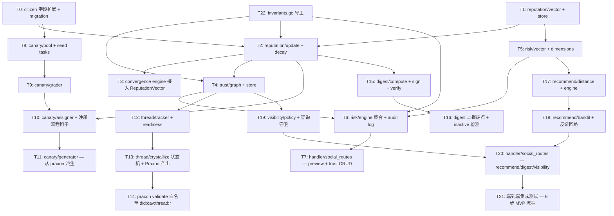

# Implementation Tasks: CAV Social Trust

8 周 MVP，按 design.md §7 切到 5 个 milestone。所有任务在 `server/cav-gateway/internal/social/` 下展开，少量改动落到 `internal/citizen`、`internal/consensus`、`internal/handler`、`cav-node/internal/praxon`。

## Task Dependency Graph

---

## M1 — Reputation Vector + Citizen 扩展 (周 1-2)

### T0. Citizen 字段扩展 + Migration

- **Status**: ✅ Done
- **Files**:
  - 修改 `server/cav-gateway/internal/citizen/persistent_registry.go`
  - 新增 `server/cav-gateway/internal/citizen/types.go`（如尚未独立）
  - 新增 `server/cav-gateway/internal/citizen/migration_test.go`
- **Requirements**: R3-1, R8-6
- **Design**: §6.2
- **Implementation**:
  1. `Citizen` 增加 `State ProbationState` 和 `PubKey string`，omitempty
  2. `loadAll()` migration：`State == ""` → 设为 `active`（legacy 行为）
  3. 新增 `SetState(did, state)` / `SetPubKey(did, key)` 方法
  4. 新增 `ByState(state) []*Citizen` 查询
- **Verification**:
  - Unit: 旧 JSON（无 state 字段）反序列化后 EnsureRegistered 仍工作
  - Unit: SetState 持久化后重启仍存在
  - Unit: ByState 索引正确返回
- **DoD**: 现有 main_test.go 全绿；migration_test.go 全绿

---

### T1. Reputation Vector 类型 + Store

- **Status**: ✅ Done
- **Files**:
  - 新增 `server/cav-gateway/internal/social/reputation/vector.go`
  - 新增 `server/cav-gateway/internal/social/reputation/store.go`
  - 新增 `server/cav-gateway/internal/social/reputation/store_test.go`
- **Requirements**: R4-1..R4-3, R4-6, R4-10
- **Design**: §2.3, §3
- **Implementation**:
  1. `Vector`、`TierVector`、`DomainScore`、`BehavioralSubvector` 类型
  2. `EffectiveScore(domain) float64` 方法
  3. `Store` 接口 + BadgerDB 实现：`Get/Put/All/EventAppend`
  4. 内存缓存 + 写穿透（与 citizen registry 同模式）
  5. Bootstrap：legacy citizen.Level → 默认 vector 映射（§6.1）
- **Verification**:
  - Unit: 往返序列化保形状
  - Unit: EffectiveScore 在 confidence=0 时返回 0
  - Unit: legacy Level 1/2/3 → 预期 score
  - Unit: cache 与 disk 一致性（写后重启读）
- **DoD**: store_test.go 全绿；覆盖率 ≥ 85%

---

### T2. Reputation Update + Decay

- **Status**: ✅ Done
- **Depends on**: T0, T1
- **Files**:
  - 新增 `server/cav-gateway/internal/social/reputation/update.go`
  - 新增 `server/cav-gateway/internal/social/reputation/decay.go`
  - 新增 `server/cav-gateway/internal/social/reputation/update_test.go`
  - 新增 `server/cav-gateway/internal/social/reputation/decay_test.go`
- **Requirements**: R4-4, R4-5, R4-7, R4-8, R4-9
- **Design**: §5.3
- **Implementation**:
  1. `ReputationEvent` 类型 + `UpdateFromEvent(ev)` 接口（不变性：唯一写路径）
  2. `ProcessGroundTruth(episodeID, trueOutcome)` retrospective 逻辑
  3. 跟风惩罚：grounding ∈ {observation, tool_result} 视为 independent，否则惩罚 ×1.5
  4. `BatchDecay(now)` — operational 半衰期 90d，deliberation 730d
  5. confidence 半衰减用 `sqrt(0.5^(elapsed/half_life))`
- **Verification**:
  - Unit: independent vs follower 的 delta 比例（独立基线 vs 跟风 ×1.5 惩罚）
  - PBT (200 runs): `BatchDecay(t)` 幂等 — 连续两次 = 一次（在 LastUpdated 不变时）
  - Unit: 衰减只降不升
  - Unit: 直接修改 store.Put 的 score 字段被 invariant guard 拒绝（T22 后联动）
- **DoD**: 全绿；PBT 通过

---

### T3. Convergence Engine 接入 ReputationVector

- **Status**: ✅ Done
- **Depends on**: T2
- **Files**:
  - 修改 `server/cav-gateway/internal/consensus/convergence.go`
  - 修改 `server/cav-gateway/internal/consensus/convergence_test.go`
- **Requirements**: R1-5, R4-1
- **Design**: §6.1
- **Implementation**:
  1. `Vote` 增加 `ReputationVector *reputation.Vector` 和 `Domain string`
  2. `Evaluate` 中：若 `ReputationVector != nil && Domain != ""` 用 `EffectiveScore(Domain)`，否则 fallback 到 `Reputation`
  3. 保留旧 `Reputation float64` 字段以兼容现有调用
- **Verification**:
  - 现有 convergence_test.go 全部通过（回归 — 旧 path 不变）
  - 新增: 同一组 votes，注入 vector 后高 confidence/domain 匹配的 agent 权重 > legacy
  - 新增: vector 为 nil 时行为与旧版完全一致
- **DoD**: 测试全绿；回归零失败

---

## M2 — Trust Graph + Risk Engine (周 3-4)

### T4. Trust Graph + Store

- **Status**: ✅ Done
- **Depends on**: T2
- **Files**:
  - 新增 `server/cav-gateway/internal/social/trust/types.go`
  - 新增 `server/cav-gateway/internal/social/trust/graph.go`
  - 新增 `server/cav-gateway/internal/social/trust/store.go`
  - 新增 `server/cav-gateway/internal/social/trust/store_test.go`
- **Requirements**: R1-1..R1-8
- **Design**: §2.1, §3
- **Implementation**:
  1. `TrustEdge`、`TrustKind`、`RiskVectorSnapshot` 类型
  2. `AddTrust(edge)` — 经过 invariants.AssertEdgeInvariants
  3. `RevokeTrust(edgeID, reason)` — 软删除（设 RevokedAt）
  4. `Edges(from, kind?, domain?)` / `Reverse(to, ...)` 查询
  5. BadgerDB schema：`t:edge:*` + 反向索引 `t:rev:*`
  6. Decay 后台任务（衰减权重，非删除）— `decay.go`
- **Verification**:
  - Unit: 同 (from, to, kind, domain) 重复 add → 拒绝
  - Unit: Cognitive 无 domain → 拒绝；Social 有 domain → 拒绝
  - Unit: 反向查询返回正确
  - Unit: revoke 后 `Edges(from)` 默认不包含，但 `Edges(from, includeRevoked=true)` 包含
- **DoD**: 全绿

---

### T5. Risk Vector 类型 + 单维度计算器

- **Status**: ✅ Done
- **Depends on**: T1
- **Files**:
  - 新增 `server/cav-gateway/internal/social/risk/vector.go`
  - 新增 `server/cav-gateway/internal/social/risk/epistemic.go`
  - 新增 `server/cav-gateway/internal/social/risk/behavioral.go`
  - 新增 `server/cav-gateway/internal/social/risk/structural.go`
  - 新增 `server/cav-gateway/internal/social/risk/dimensions_test.go`
- **Requirements**: R2-2, R2-3, R2-9..R2-17
- **Design**: §2.2, §5.1
- **Implementation**:
  1. `TrustRiskVector`、`Dimension`、`EpistemicRisk`、`BehavioralRisk`、`StructuralRisk`、`DominantFactor`
  2. Epistemic 4 个计算器，各自接收 `(praxons, challenges, retractions)` 并返回 `*Dimension`
  3. Behavioral 3 个计算器：conformity_index (Pearson)、sybil_similarity_max (cosine)、activity_anomaly (KL 散度)
  4. Structural 2 个计算器（实时）：diversity_impact、echo_chamber_delta
  5. 每个计算器内部判断 sufficient（最低样本量映射常量表）
- **Verification**:
  - Unit: 每个维度的边界（样本不足 → Sufficient=false）
  - Unit: ground_truth_alignment：5 验证 / 5 命中 → score=0；5/0 → score=1
  - Unit: conformity_index 单调性 — 跟随多数比例越高 → 分数越高（PBT）
  - Unit: structural diversity_impact 在 subject 完全覆盖 requester 已有 domain 时 = 0
- **DoD**: 全绿；PBT 200 runs

---

### T6. Risk Engine 聚合 + Audit Log

- **Status**: ✅ Done
- **Depends on**: T4, T5
- **Files**:
  - 新增 `server/cav-gateway/internal/social/risk/engine.go`
  - 新增 `server/cav-gateway/internal/social/risk/audit.go`
  - 新增 `server/cav-gateway/internal/social/risk/engine_test.go`
- **Requirements**: R2-1, R2-4..R2-7, R2-8, NFR-1, NFR-7
- **Design**: §5.1, §3 (r:audit:*)
- **Implementation**:
  1. `Engine.Compute(ctx, requester, subject, kind, domain)` 并发拉取数据 + 调度计算器
  2. 聚合权重：Epistemic 0.45 / Behavioral 0.35 / Structural 0.20
  3. Sufficient < 2 → 强制 `defer`
  4. Top-3 dominant factors 提取
  5. Reasoning 模板化输出
  6. Audit log：JCS 序列化 → SHA-256 → 写 `r:audit:<hash>`，索引 `r:by_pair:*`
  7. p95 < 500ms（NFR-1）— 数据拉取并发，使用 errgroup
- **Verification**:
  - Unit: 所有维度满分 → critical / reject
  - Unit: 仅 1 个 sufficient 维度 → defer
  - Unit: audit log 写入后可按 hash 检索
  - Unit: 同输入 → 同 vector_hash（确定性，PBT）
  - Bench: p95 < 500ms（10k signals 历史 mock）
- **DoD**: 全绿；bench 达标

---

### T7. Handler — Preview + Trust CRUD

- **Status**: ✅ Done
- **Depends on**: T6
- **Files**:
  - 新增 `server/cav-gateway/internal/handler/social_routes.go`
  - 修改 `server/cav-gateway/main.go`（路由挂载）
  - 新增 `server/cav-gateway/internal/handler/social_routes_test.go`
- **Requirements**: R2-1, R1-1, R1-8
- **Design**: §4.1
- **Implementation**:
  1. `POST /v1/social/trust/preview` → 调 risk.Engine.Compute → 返回 vector
  2. `POST /v1/social/trust` → 先 preview → 写 TrustEdge（含 RiskSnapshot）
  3. `DELETE /v1/social/trust/{edgeID}` 软删除
  4. `GET /v1/social/trust` 列表 + 过滤
  5. `GET /v1/social/risk/audit/{hash}` 审计读
  6. `GET /v1/social/reputation/{did}`
  7. JWT 鉴权复用 `auth/fingerprint.go`，state != active 拒绝写
- **Verification**:
  - Integration: preview → trust → list → revoke 完整流程
  - Integration: probation state 调用 trust → 403
  - Integration: audit hash 与 trust edge 中的 snapshot.VectorHash 一致
- **DoD**: 全绿

---

## M3 — Probation + Canary (周 5-6)

### T8. Canary Pool + Seed Tasks

- **Status**: ✅ Done
- **Depends on**: T0
- **Files**:
  - 新增 `server/cav-gateway/internal/social/canary/types.go`
  - 新增 `server/cav-gateway/internal/social/canary/pool.go`
  - 新增 `server/cav-gateway/internal/social/canary/pool_test.go`
  - 新增 `server/cav-gateway/internal/social/canary/seed/*.json`（每 capability domain ≥ 3 个种子）
- **Requirements**: R3-3, R3-4, R3-5, R3-9, R3-10
- **Design**: §2.4, §3 (c:task:*)
- **Implementation**:
  1. `CanaryTask` 类型（`groundTruth` 字段 unexported，JSON tag `-`）
  2. `Pool.Get(taskID)` / `Pool.RandomByDomain(domain, exclude)` / `Pool.Size(domain)`
  3. Seed loader：启动时从 `seed/*.json` 读入并 upsert
  4. Sanitize 函数：返回给 client 时剥离 ground truth
- **Verification**:
  - Unit: JSON marshal 后不包含 groundTruth 字段
  - Unit: RandomByDomain 不返回 exclude 列表中的
  - Unit: 启动后每个 domain pool ≥ seed 数量
- **DoD**: 全绿；seed 文件覆盖至少 3 个 domain

---

### T9. Canary Grader

- **Status**: ✅ Done
- **Depends on**: T8
- **Files**:
  - 新增 `server/cav-gateway/internal/social/canary/grader.go`
  - 新增 `server/cav-gateway/internal/social/canary/grader_test.go`
- **Requirements**: R3-6, R3-7
- **Design**: §5.5
- **Implementation**:
  1. `Grade(submission *praxon.Praxon, task *CanaryTask) TaskScores`
  2. 4 维评分：alignment、methodology、time_pattern、grounding
  3. similarity 用归一化 token 集合 + Jaccard（Phase 1 简化，避免引入 LLM）
  4. methodology_match：tag 集合交集占期望集合的比例
  5. `Passed`：alignment ≥ 0.6 AND methodology ≥ 0.5
- **Verification**:
  - Unit: 与 ground truth conclusion 完全一致 → alignment = 1
  - Unit: 缺失 required methodology tag → methodology < 0.5 → fail
  - Unit: 提交时间在合理窗口 → time_pattern = 1
- **DoD**: 全绿

---

### T10. Canary Assigner + 注册钩子

- **Status**: ✅ Done
- **Depends on**: T2, T9
- **Files**:
  - 新增 `server/cav-gateway/internal/social/canary/assigner.go`
  - 修改 `server/cav-gateway/internal/citizen/persistent_registry.go`（注册时回调）
  - 新增 `server/cav-gateway/internal/social/canary/assigner_test.go`
- **Requirements**: R3-1, R3-2, R3-3, R3-8, R3-11
- **Design**: §5.5
- **Implementation**:
  1. `CitizenStatus` BadgerDB 持久化 (`p:status:*`, `p:assigned:*`, `p:result:*`)
  2. 注册钩子：新 citizen → SetState(probation) + AssignTasks(3, 跨 capability)
  3. `Submit(did, taskID, praxon)` → grader → result → 更新 reputation seed → SetState(active|restricted)
  4. Restricted retry：检查 `next_retry_at`，过早拒绝
  5. Cron：每 30 天分配 1 个校准 task（不改 state）
- **Verification**:
  - Integration: 新注册 → state=probation → 不能调 trust API（403）
  - Integration: 提交 3 个合格 praxon → state=active → reputation 有 seed 值
  - Integration: 1 个失败 → state=restricted + next_retry_at 24h 后
  - Integration: 持续校准 cron 触发后 active citizen 收到新 task 但 state 不变
- **DoD**: 全绿

---

### T11. Canary Generator — 从 Praxon 派生

- **Status**: ✅ Done
- **Depends on**: T8
- **Files**:
  - 新增 `server/cav-gateway/internal/social/canary/generator.go`
  - 新增 `server/cav-gateway/internal/social/canary/generator_test.go`
- **Requirements**: R3-9
- **Design**: §5.5, §10 (OQ-1)
- **Implementation**:
  1. `TaskGenerator` 接口（具体 LLM-aided 实现可后置）
  2. 默认 stub 实现：从 canonical praxon 抽取 `evidence_summary` 作 prompt，`conclusion` 作 ground truth，`methodology` 作 expectations
  3. 30 天时间窗过滤
  4. Cron：每天检查 pool size < 100 → 触发生成
- **Verification**:
  - Unit: stub 生成的 task 不包含原 praxon 的 conclusion 文本（在 prompt 中应该被掩码）
  - Unit: 30 天内 crystallized 的 praxon 不被选中
  - Unit: 生成后 pool size 增加
- **DoD**: 全绿；stub 可工作（LLM-aided 生成可在 Phase 2）

---

## M4 — Thread Crystallization + Digest (周 6-7)

### T12. Thread Tracker + Readiness

- **Status**: ✅ Done
- **Depends on**: T4
- **Files**:
  - 新增 `server/cav-gateway/internal/social/thread/types.go`
  - 新增 `server/cav-gateway/internal/social/thread/readiness.go`
  - 新增 `server/cav-gateway/internal/social/thread/tracker.go`
  - 新增 `server/cav-gateway/internal/social/thread/readiness_test.go`
- **Requirements**: R5-1, R5-2, R5-10, NFR-2
- **Design**: §2.5, §5.2
- **Implementation**:
  1. `Thread`、`ReadinessScore`、`ReadinessSnapshot`、`CrystallizationLevel`
  2. `Tracker.OnSignal(sig)` — 沿 InReplyTo 上溯到 root → 更新 thread → 重算 readiness
  3. 5 因子加权：consensus 0.30 + diversity 0.25 + participation 0.15 + confidence 0.20 + maturity 0.10
  4. 自适应 target_participants：networkSize < 20 → 3，否则 5
  5. BadgerDB 索引：`th:meta:*` + `th:active:*` + `th:by_participant:*`
- **Verification**:
  - Unit: 每个因子单测（已知输入 → 已知分数）
  - Unit: 5 因子加权和正确
  - Unit: networkSize=10 时 target=3
  - Bench: 单 thread 单 signal 增量更新 p95 < 100ms
- **DoD**: 全绿；bench 达标

---

### T13. Crystallize 状态机 + Praxon 产出

- **Status**: ✅ Done
- **Depends on**: T12
- **Files**:
  - 新增 `server/cav-gateway/internal/social/thread/crystallize.go`
  - 新增 `server/cav-gateway/internal/social/thread/crystallize_test.go`
- **Requirements**: R5-3..R5-9, R5-11, R5-12
- **Design**: §5.2
- **Implementation**:
  1. 状态机：none → draft → provisional → canonical（升级）；canonical → provisional → draft → retracted（降级）
  2. 升级触发：readiness 跨阈值时产出 / 升级 Praxon
  3. issuer = `did:cav:thread:<thread_id>`
  4. provenance.derived_from = signal IDs；consensus_episode = thread ID
  5. 与 cav-node webhook/relay 集成：通过现有 `webhook.Relay` 把产出推送
  6. 降级 → emit `signal.SignalRetraction`
- **Verification**:
  - Integration: mock thread readiness 上升 → 产出 Provisional → 继续上升 → 升级 Canonical
  - Integration: 注入挑战使 readiness 下降 → 降级
  - Unit: provenance 字段完整（derived_from 数组、consensus_episode 字符串）
- **DoD**: 全绿

---

### T14. Praxon Validate 白名单 — `did:cav:thread:*`

- **Status**: ✅ Done
- **Depends on**: T13
- **Files**:
  - 修改 `server/cav-node/internal/praxon/validate.go`
  - 新增 `server/cav-node/internal/praxon/thread_issuer_test.go`
- **Requirements**: R5-3..R5-5, OQ-3
- **Design**: §6.3, §10
- **Implementation**:
  1. issuer 校验放宽：允许 `did:cav:thread:*` 前缀
  2. 此类 issuer 必须有 `provenance.consensus_episode` 字段
  3. 校验 `derived_from` 非空且至少 2 项
- **Verification**:
  - Unit: 缺失 consensus_episode 的 thread issuer praxon → 拒绝
  - Unit: 单 derived_from → 拒绝
  - Unit: legacy issuer 校验路径不受影响（回归）
- **DoD**: 现有 praxon 测试全绿；新增测试通过

---

### T15. Behavioral Digest — Compute + Sign + Verify

- **Status**: ✅ Done
- **Depends on**: T2
- **Files**:
  - 新增 `server/cav-gateway/internal/social/digest/types.go`
  - 新增 `server/cav-gateway/internal/social/digest/compute.go`
  - 新增 `server/cav-gateway/internal/social/digest/sign.go`
  - 新增 `server/cav-gateway/internal/social/digest/sign_test.go`
- **Requirements**: R8-1..R8-4
- **Design**: §2.6, §5.6
- **Implementation**:
  1. `BehavioralDigest` 结构体
  2. `Compute(did, periodStart, periodEnd)` 从 signal store 聚合统计
  3. `Sign(d, privkey)` / `Verify(d, pubkey)` — Ed25519
  4. JCS 序列化 → 签名
  5. period 顺序检查（ratchet）— `d:latest:<did>` 单调递增
- **Verification**:
  - Unit: sign → verify 往返
  - Unit: 篡改任一字段 → verify fail
  - Unit: period 回退 → 写入拒绝
- **DoD**: 全绿

---

### T16. Digest 上报端点 + Inactive 检测

- **Status**: ✅ Done
- **Depends on**: T15
- **Files**:
  - 修改 `server/cav-gateway/internal/handler/social_routes.go`
  - 新增 `server/cav-gateway/internal/social/digest/inactive.go`
  - 新增 `server/cav-gateway/internal/social/digest/inactive_test.go`
- **Requirements**: R8-1, R8-6
- **Design**: §4.1, §5.6
- **Implementation**:
  1. `POST /v1/social/digest` — verify 后写 `d:digest:*` + 更新 `d:latest:*`
  2. Inactive cron：每天扫描 `d:latest:*`，过去 7 天无 digest → 在 reputation 中标记 inactive（EffectiveScore × 0.5）
  3. 用户重新发 digest → 自动取消 inactive
- **Verification**:
  - Integration: 上报无效签名 → 401
  - Integration: 上报 period 回退 → 409
  - Integration: 7 天 + 1 秒后 → inactive 标记；下次 digest → 取消标记
- **DoD**: 全绿

---

## M5 — Recommendation + Visibility + E2E (周 7-8)

### T17. Recommendation Engine — Distance + Score

- **Status**: ✅ Done
- **Depends on**: T5
- **Files**:
  - 新增 `server/cav-gateway/internal/social/recommend/types.go`
  - 新增 `server/cav-gateway/internal/social/recommend/distance.go`
  - 新增 `server/cav-gateway/internal/social/recommend/engine.go`
  - 新增 `server/cav-gateway/internal/social/recommend/engine_test.go`
- **Requirements**: R6-1..R6-4, R6-9, NFR-3
- **Design**: §5.4
- **Implementation**:
  1. `methodology_distance(a, b)` — JS divergence on (prior_source_tag, inference_method_tag) 联合分布
  2. `domain_overlap(a, b)` — Jaccard
  3. `Engine.Generate(requester)` — score = m_dist × overlap × (1 - risk)
  4. 分级：strong/moderate/exploratory
  5. Top 5 + 预附 TrustRiskVector
  6. 离线 cron：每周一次，1000 agents < 10min（NFR-3）
- **Verification**:
  - Unit: 完全相同方法论的两 agent → m_dist = 0
  - Unit: 完全不重叠 domain → overlap = 0 → score = 0
  - Bench: 1000 mock agents 全量计算 < 10min
- **DoD**: 全绿；bench 达标

---

### T18. Bandit + 反馈回路 + 预警

- **Status**: ✅ Done
- **Depends on**: T17
- **Files**:
  - 新增 `server/cav-gateway/internal/social/recommend/bandit.go`
  - 新增 `server/cav-gateway/internal/social/recommend/feedback.go`
  - 新增 `server/cav-gateway/internal/social/recommend/bandit_test.go`
- **Requirements**: R6-5, R6-6, R6-7, R6-8
- **Design**: §5.4
- **Implementation**:
  1. ε-greedy bandit，策略空间 = (weight_methodology, weight_domain, exploration_bias) 离散网格
  2. `Engine.Generate` 调用 bandit 选择当前策略
  3. 接受 → 30 天延迟观察任务（cron 调度）
  4. outcome_score = Δconformity_index + Δdiversity_entropy + Δchallenge_success
  5. 预警触发：conformity 连续 3 周上升 OR domain entropy 连续下降 → 强制额外推荐
- **Verification**:
  - Unit: bandit 收到正反馈后该策略选择概率上升
  - Unit: 80/20 exploitation/exploration 分布
  - Integration: 预警触发额外推荐生成
- **DoD**: 全绿

---

### T19. Visibility Policy + 查询守卫

- **Status**: ✅ Done
- **Depends on**: T4
- **Files**:
  - 新增 `server/cav-gateway/internal/social/visibility/policy.go`
  - 修改 `server/cav-gateway/internal/social/trust/graph.go`（注入守卫）
  - 新增 `server/cav-gateway/internal/social/visibility/policy_test.go`
- **Requirements**: R7-1..R7-7
- **Design**: §5.7
- **Implementation**:
  1. `VisibilityPolicy` + Store (`v:policy:*`)
  2. 默认 `public`
  3. `GetTrustEdges(viewer, target)` 守卫：private/mutual_only 校验
  4. Reputation/digest/domain_activity 端点强制公开（无视 policy）
- **Verification**:
  - Unit: private + viewer != target → 拒绝
  - Unit: mutual_only + 无双向信任 → 拒绝
  - Unit: 改 policy 后下次查询立即生效（缓存失效）
  - Unit: GET reputation 不受 policy 影响
- **DoD**: 全绿

---

### T20. Handler — Recommend / Digest / Visibility 端点

- **Status**: ✅ Done
- **Depends on**: T18, T19
- **Files**:
  - 修改 `server/cav-gateway/internal/handler/social_routes.go`
  - 新增 `server/cav-gateway/internal/handler/social_routes_m5_test.go`
- **Requirements**: §4.1 剩余端点
- **Design**: §4.1
- **Implementation**:
  1. `GET /v1/social/recommend` → 返回当前缓存的推荐
  2. `POST /v1/social/recommend/{id}/feedback` → 记录采纳并 schedule observation
  3. `PUT /v1/social/visibility` → 更新 policy
  4. `GET /v1/social/probation/status` / `tasks` / `submit`（如 M3 未挂入此处一并完成）
  5. `GET /v1/social/threads/{id}/readiness` / `active`
- **Verification**:
  - Integration: 完整端点黑盒测试
  - Integration: 鉴权失败 → 401；state 错误 → 403
- **DoD**: 全绿

---

### T21. 端到端集成测试 — 6 步 MVP 流程

- **Status**: ✅ Done
- **Depends on**: T20
- **Files**:
  - 新增 `server/cav-gateway/internal/social/__tests__/e2e_test.go`
- **Requirements**: requirements.md MVP 目标 1-6
- **Design**: §9.2
- **Implementation**:
  跑通 6 步：
  1. 注册新 agent → state == probation
  2. 拉取 task → 提交 3 个合格 praxon → state == active，reputation seeded
  3. agent_a 调用 `/trust/preview` → 返回含 dominant_factors 的 vector
  4. agent_a `POST /trust` → edge 持久化 + risk snapshot 一致
  5. agent_b 在 crypto 域发 endorsement → convergence 用新 reputation 加权（验证：移除 trust 后权重明显下降）
  6. recommendation 引擎产出 ≥ 1 strong/moderate
  7. 多 agent 在 thread 中讨论 → readiness ≥ 0.7 → 自动产出 Provisional Praxon
- **Verification**:
  - 整个流程在 fresh BadgerDB 实例上跑通
  - 7 步全部断言通过
- **DoD**: 全绿；总耗时 < 30s

---

## Cross-cutting

### T22. Invariants 守卫

- **Status**: ✅ Done
- **Files**:
  - 新增 `server/cav-gateway/internal/social/invariants.go`
  - 新增 `server/cav-gateway/internal/social/invariants_test.go`
- **Requirements**: design §11
- **Implementation**:
  实现 7 条不变性的守卫函数，所有写路径必须经过：
  1. `AssertEdgeUnique(graph, edge)` — 同 (from, to, kind, domain) 非 revoked 唯一
  2. `AssertCognitiveDomain(edge)` — Cognitive 必须有 domain；Social 不能有
  3. `AssertReputationViaEvent(...)` — store.Put 前必须有对应 event
  4. `AssertAuditImmutable(...)` — 写入后不允许更新
  5. `AssertCanaryGroundTruthHidden(taskJSON)` — 序列化结果不含 ground truth 字段
  6. `AssertDigestSelfSigned(d)` — 必须经过 verify
  7. `AssertChallengeable(praxon)` — 不允许写入封印标记
- **Verification**:
  - Unit: 每条不变性的 negative case 都被守卫拒绝
  - Integration: 在 T2/T4/T6/T8/T15 中的 store 入口都引用守卫
- **DoD**: 全绿；其他 milestone 任务在引入守卫后回归测试不破

---

## Definition of Done — Spec 整体

- 所有 22 个任务 DoD 达成
- `go test ./server/cav-gateway/internal/social/...` 全绿
- `go test ./server/cav-gateway/internal/consensus/...` 全绿（回归）
- `go test ./server/cav-node/internal/praxon/...` 全绿（回归）
- T21 端到端测试稳定通过 5 次连跑
- 性能：T6 bench p95 < 500ms；T12 bench p95 < 100ms；T17 bench < 10min
- README 增补：`server/cav-gateway/README.md` 增加 social 模块说明

---

## Out of Scope（推迟到后续 spec）

- Phase 2 风险维度 (R2-18..21) — feature flag，等 50+ active agent
- LLM-aided canary task 生成 — T11 stub 已经满足 MVP；上线后接入
- 跨网络 reputation 迁移 — OQ-4
- Anti-conformity engine 的完整实现 — `cav-anti-conformity-consensus`
- Deliberation tier 的完整治理流程 — `cav-deliberation-layer`
