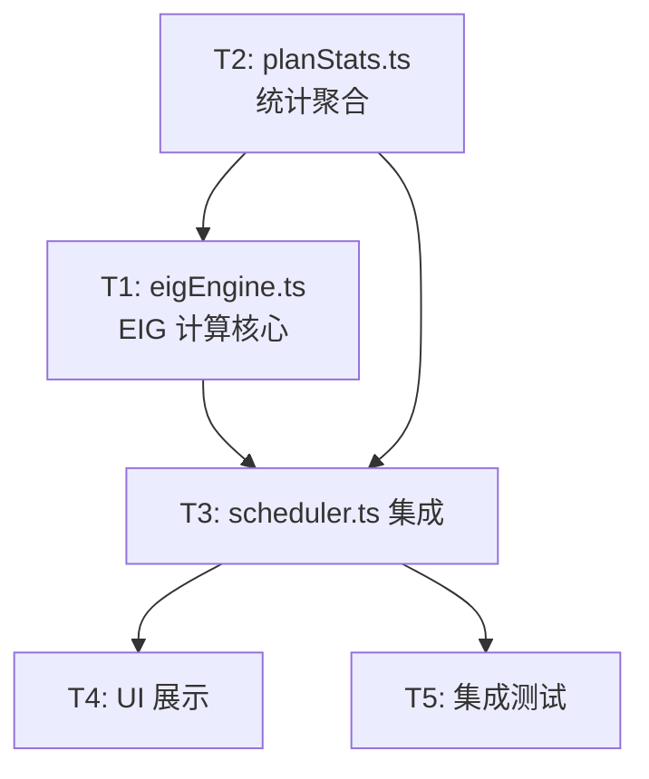

# Implementation Tasks: PEV EIG Scheduler

## Task Dependency Graph



## Task List

### T1. EIG 计算引擎

- **Status**: ⬜ Pending
- **Files**:
  - 新增 `src/services/cav/pev/eigEngine.ts`
  - 新增 `src/services/cav/pev/__tests__/eigEngine.test.ts`
- **Requirements**: R1
- **Design**: Core Algorithm
- **Implementation**:
  1. `binaryEntropy(p: number): number` — 二元熵，clamp 输入到 [0.001, 0.999]
  2. `computeEIG(hypothesis, plan, ledger, priors?): { eig, breakdown }` — 完整 EIG 计算
  3. `computeExplorationBonus(hypothesis, plan, ledger, weight): number` — 探索加成
  4. `rankCandidates(candidates): sorted[]` — 按 EIG+bonus 降序排序
- **Verification**:
  - PBT: EIG ∈ [0, 1] for any valid input
  - PBT: EIG(p=0.5) ≥ EIG(p=0.9) when plan stats are symmetric
  - Unit: confidence=0.5 + uniform plan → EIG ≈ 1.0
  - Unit: confidence=0.99 → EIG ≈ 0
  - Unit: exploration bonus = 0 when already tested
- **DoD**: eigEngine.test.ts 全绿; PBT 200 runs

---

### T2. Plan Stats 聚合

- **Status**: ⬜ Pending
- **Files**:
  - 新增 `src/services/cav/pev/planStats.ts`
  - 新增 `src/services/cav/pev/__tests__/planStats.test.ts`
- **Requirements**: R4
- **Design**: Plan Stats Aggregation
- **Implementation**:
  1. `computePlanStats(planId, ledger): PlanStats` — 从 evidenceLog 统计
  2. Laplace smoothing when sampleCount < 3
  3. Uniform prior when sampleCount === 0
- **Verification**:
  - Unit: empty ledger → uniform prior (0.4/0.4/0.2)
  - Unit: 3 confirms + 1 falsify → rates match
  - Unit: sampleCount < 3 → smoothing applied
  - Unit: pure function (same input → same output)
- **DoD**: planStats.test.ts 全绿

---

### T3. Scheduler 集成

- **Status**: ⬜ Pending
- **Depends on**: T1, T2
- **Files**:
  - 修改 `src/services/cav/pev/scheduler.ts` (内部实现，不改签名)
  - 修改 `src/services/cav/pev/__tests__/scheduler.test.ts` (新增 EIG 测试)
- **Requirements**: R2, R3, R7
- **Design**: EIG-aware Schedule Algorithm
- **Implementation**:
  1. 新增 `SchedulerOpts` 类型 with `strategy` field
  2. 内部 `scheduleWithEIG` 路径
  3. 向后兼容：`strategy='greedy-confidence'` 走旧路径
  4. `ScheduleDirective` 新增 `eig?` 和 `eigBreakdown?` 字段
  5. Low-information 检测 (EIG < 0.01)
- **Verification**:
  - 现有 scheduler.test.ts 全部通过（回归）
  - 新增: EIG 策略选 confidence=0.5 的 H 而非 confidence=0.9 的
  - 新增: low-information hint 触发
  - 新增: exploration bonus 影响排序
  - 新增: tie-break by cost then id
- **DoD**: scheduler.test.ts 全绿 (旧 + 新)

---

### T4. UI 展示

- **Status**: ⬜ Pending
- **Depends on**: T3
- **Files**:
  - 修改 `src/commands/ccb-pev/PevSession.tsx` (显示 EIG)
  - 修改 `src/commands/ccb-pev/AgentStatusBar.tsx` (directive 区域)
- **Requirements**: R6
- **Implementation**:
  1. AgentStatusBar: 当 directive 有 `eig` 字段时显示 `EIG=0.72b`
  2. PevSession header: 显示本轮平均 EIG
  3. Final summary: "Information Efficiency" 段
- **DoD**: 手动验证 UI 显示正确

---

### T5. 集成测试 + 回归

- **Status**: ⬜ Pending
- **Depends on**: T3
- **Files**:
  - 新增 `src/services/cav/pev/__tests__/eig-integration.test.ts`
- **Requirements**: R7
- **Implementation**:
  1. 跑完整 PEV 4 轮 with EIG strategy
  2. 验证 EIG 策略选择的 (H, plan) 对与 greedy 不同
  3. 验证 information efficiency > 0
  4. 验证现有 pev-e2e.test.ts 仍通过
- **DoD**: 全部测试绿; `bun test src/services/cav/pev/__tests__/` 零失败

---

## 整体验收

```bash
bun test src/services/cav/pev/__tests__/
bun test src/commands/ccb-pev/__tests__/
bun run typecheck
```

全部通过即收工。
